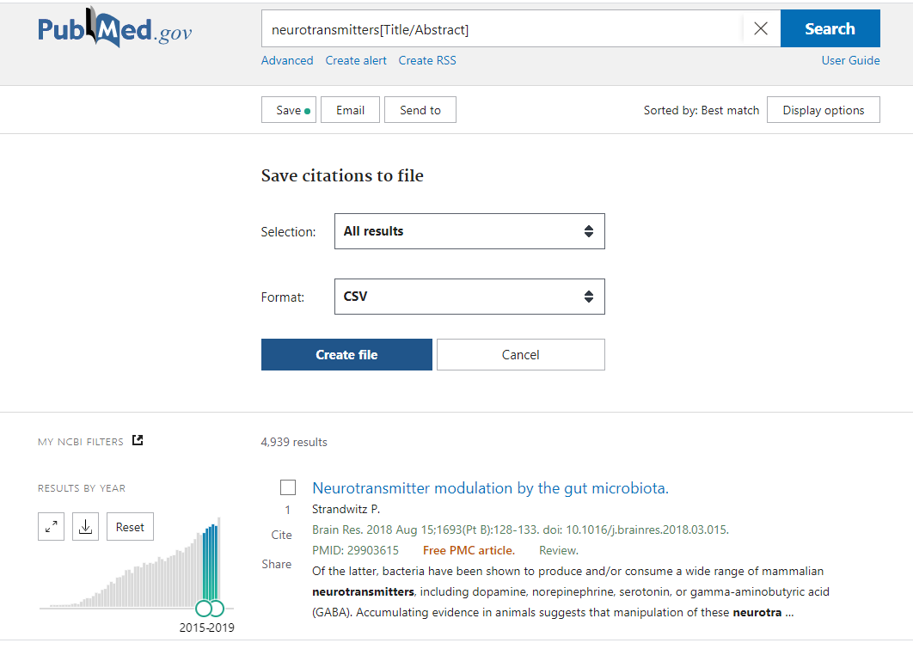
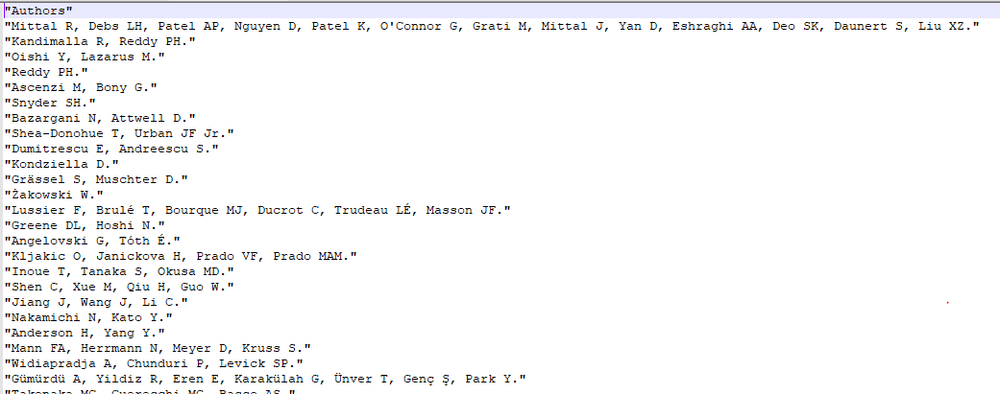
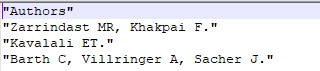
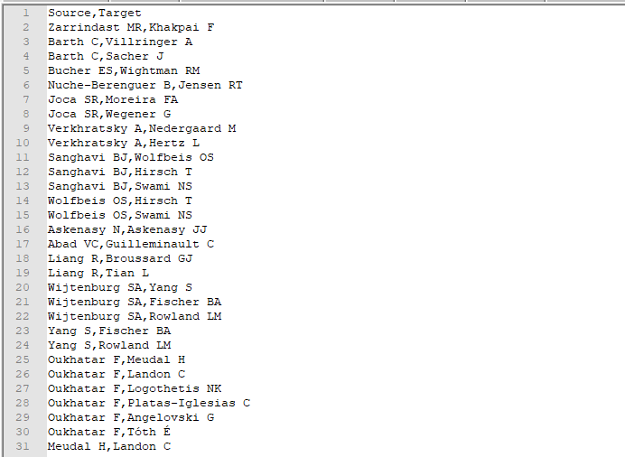

```{r setup, include=FALSE}
knitr::opts_chunk$set(echo = TRUE)
```

# Introduction

Ce projet à pour but d'étudier l'évolution des réseaux d'intéraction de la communauté scientifique du domaine des neurotransmetteurs entre 2015 et 2019. Ces données sont issus du site PubMed, un moteur de recherche spécialisé dans les publications scientifiques.


# Extraction des publications scientifiques

Pour cette étude nous allons rechercher les publications scientifiques ayant comme titre "neurotransmitters" entre 2015 et 2019. Pour cela, nous avons réalisé une requête le 16/12/2020 et nous avons obtenu un résultat de 4,939. (cf figure 1) publications.


Figure 1:Téléchargement des données sur pubMed de 2015 à 2019

## Import des données

```{r imports-librairies, echo=FALSE}
#librairies
library(readxl) 
```

```{r imports, echo=TRUE}
#imports des données
pubmed <- read.csv(file = '~/R/projects/BigDataProject/data/excel/csv-neurotrans-set-2.csv')
```

## Préparation des données

Nous allons récupérer les colonnes "Authors" et "Publication Year et créer 5 vecteurs correspondants à une année".

```{r authors, echo=TRUE}
authors <- pubmed[,c("Authors", "PublicationYear")]

#authors
authors2015 <- authors[authors$PublicationYear == "2015",]
authors2016 <- authors[authors$PublicationYear == "2016",]
authors2017 <- authors[authors$PublicationYear == "2017",]
authors2018 <- authors[authors$PublicationYear == "2018",]
authors2019 <- authors[authors$PublicationYear == "2019",]

```

Nous allons maintenant sauvegarder les auteurs de ces vectors dans un fichier csv (cf figure 2) 

```{r sauvegarde, echo=TRUE}

#On ne garde que les auteurs
authors2015 <- authors2015["Authors"]
authors2016 <- authors2016["Authors"]
authors2017 <- authors2017["Authors"]
authors2018 <- authors2018["Authors"]
authors2019 <- authors2019["Authors"]


#sauvegarde en fichier csv
write.csv (authors2015, file = "export/authors2015.csv", row.names=FALSE)
write.csv (authors2016, file = "export/authors2016.csv", row.names=FALSE)
write.csv (authors2017, file = "export/authors2017.csv", row.names=FALSE)
write.csv (authors2018, file = "export/authors2018.csv", row.names=FALSE)
write.csv (authors2019, file = "export/authors2019.csv", row.names=FALSE)
```



Figure 2: extrait des premières lignes concernant les plucations de 2018


# 2 Création du graphe correspondant aux co-auteurs

## Détermination nombre de sommets

Tout d'abord, nous allons trouver le moyen de compter le nombre d'auteurs par ligne à l'aide des fonctions suivantes :

```{r sommets, echo=TRUE}

length(row1<-unlist(strsplit(toString(authors2015[1,]), split=",")))
length(row2<-unlist(strsplit(toString(authors2015[2,]), split=",")))
length(row3<-unlist(strsplit(toString(authors2015[3,]), split=",")))


```

Grâce à cette commande, on peut constater que le nombre d'auteur correspondant aux lignes 1, 2, et 3 sont respectivement 2, 1 et 3. D'après la figure 3, on peut vérifier que cela correspond aux nombres d'auteurs des trois premières ligne en 2015.


Figure 3: extrait des premières lignes concernant les plucations de 2015


Ensuite, nous allons créer une fonction qui détermine le nombre de noeuds dans un vecteur. Pour cela nous allons 
utiliser la fonction de split afin de séparer chaque auteur séparé par une virgule.
```{r getSommets, echo=TRUE}
#construction fonction qui calcule le nombre d'auteurs dans un vecteur
getSommets<-function(x){
  i<-1
  nbsommets<-0
  while(i<nrow(x)){
    row<-unlist(strsplit(toString(x[i,]), split=","))
    nbsommets<- nbsommets+length(row)
    i <- i + 1
  }
 nbsommets
}
```

## Détermination du nombre d'arrêtes
La prochaine étape, est de créer une fonction permettant de déterminer les arêtes d'un graphe. Nous allons créer une matrice "output" avec deux colonnes nommées "Source" et "Target", ce format a été choisi afin de faciliter la création de graphes dans gephi. La première colonne contiendra un nom d'auteur et la deuxième colonne contiendra le nom de l'auteur avec qui il est en relation.

La construction de la fonction s'est faite tout d'abord en itérant sur chaque ligne, ensuite nous avons splitté la ligne et vérifié le nombre d'auteurs. Si le nombre d'auteurs est égal à deux, nous ajoutons une ligne dans la matrice output. Cependant lorsque le nombre d'auteurs est strictement supérieur à deux, nous itérons jusqu'à l'avant-dernier auteur et ajoutons une ligne dans la matrice output pour chacun de ces auteurs avec l'auteur plus un.

```{r getArretes, echo=TRUE}
# Returns string without leading or trailing white space
trim <- function (x) gsub("^\\s+|\\s+$", "", x)

getArretes<-function(authors){
    #create a data frame for output
    output <- data.frame(matrix(ncol = 2, nrow = 0))
    names(output)<-c("Source","Target")
    output

    i <- 1
  while (i<nrow(authors)) {
    #get Authors splited 
    row<-sub("\\.", "", authors[i,])
  
    res<-unlist(strsplit(toString(row), split=","))
    #added relations 
    j <- 1
    if(length(res) == 2){
      #create a dataFrame
      relationAuthor<-data.frame(trim(res[j][1]),trim(res[j+1][1]))
      names(relationAuthor)<-c("Source","Target")
      output <- rbind(output, relationAuthor)
    }
    if(length(res) > 2){
      while ((j+1)<length(res)){
        k<-j+1
        while(k<=length(res)){
          relationAuthor<-data.frame(trim(res[j][1]), trim(res[k][1]))
          names(relationAuthor)<-c("Source","Target")
          output <- rbind(output, relationAuthor)
          k<-k+1
        }
        j<- j + 1
      }
    }
    
   
    i <- i + 1
  } 
  output
}

```

## Exportation des arrêtes dans des fichier csv

```{r exportArrêtes, echo=TRUE}
#exportation des vecteurs dans un csv
nbArretes2015<- getArretes(authors2015)
nbArretes2016<- getArretes(authors2016)
nbArretes2017<- getArretes(authors2017)
nbArretes2018<- getArretes(authors2018)
nbArretes2019<- getArretes(authors2019)

write.csv (nbArretes2015, file = "export/relations/authors2015.csv", row.names=FALSE,quote=FALSE)
write.csv (nbArretes2016, file = "export/relations/authors2016.csv", row.names=FALSE, quote=FALSE)
write.csv (nbArretes2017, file = "export/relations/authors2017.csv", row.names=FALSE, quote=FALSE)
write.csv (nbArretes2018, file = "export/relations/authors2018.csv", row.names=FALSE, quote=FALSE)
write.csv (nbArretes2019, file = "export/relations/authors2019.csv", row.names=FALSE, quote=FALSE)
```

## Affichage des résultats


Figure 4: extrait co-auteurs graphe 2015

D'après la figure 4, nous constatons un extrait des co-auteurs de 2015 sous la forme source target.
Enfin nous allons créer un tableau rassemblant les informations sur le nombre de sommets, d'arêtes et de publications pour chaque années.

```{r tableconstruction, echo=TRUE}
table<- matrix(c(nrow(authors2015),nrow(authors2016),nrow(authors2017),nrow(authors2018),nrow(authors2019),
                 getSommets(authors2015),getSommets(authors2016),getSommets(authors2017),getSommets(authors2018),
                 getSommets(authors2019),
                 nrow(nbArretes2015),nrow(nbArretes2016),nrow(nbArretes2017),nrow(nbArretes2018),nrow(nbArretes2019)), nrow = 3, ncol=5, byrow=TRUE,
               dimnames = list(c("puplications", "sommets", "arrêtes"), c("2015", "2016", "2017", "2018", "2019")))
```


```{r table, echo=FALSE}
table
```

